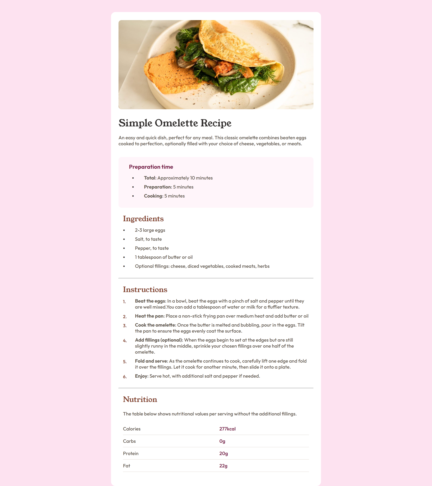

# Frontend Mentor - Recipe page solution

This is a solution to the [Recipe page challenge on Frontend Mentor](https://www.frontendmentor.io/challenges/recipe-page-KiTsR8QQKm). Frontend Mentor challenges help you improve your coding skills by building realistic projects. 

### Screenshot

### Links

- Solution URL: [Add solution URL here](https://github.com/paragbadgujar1205/Recipepagesolution.git)
- Live Site URL: [Add live site URL here](https://paragbadgujar1205.github.io/Recipepagesolution/)

### Built with

- Semantic HTML5 markup
- CSS custom properties
- Flexbox
- CSS Grid
- Mobile-first workflow

### What I learned

During this project, I gained a deeper understanding of responsive design principles and the importance of semantic HTML for accessibility. I learned how to effectively use Flexbox and CSS Grid to create a responsive layout that adapts to different screen sizes.

### Continued development

In future projects, I want to continue improving my skills in CSS Grid and Flexbox, as well as explore more advanced CSS techniques. I also plan to delve deeper into JavaScript to add more interactivity to my web pages.

### Useful resources

- [MDN Web Docs](https://developer.mozilla.org/en-US/) - This is an excellent resource for HTML, CSS, and JavaScript documentation. I frequently referred to it while working on this project.
- [CSS Tricks](https://css-tricks.com/) - This website has a wealth of articles and guides on various CSS techniques, which helped me better understand Flexbox and CSS Grid.

## Author

- Website - [Parag Badgujar](https://paragbadgujar1205.github.io/portfolio/)
- Frontend Mentor - [@paragbadgujar1205](https://www.frontendmentor.io/profile/paragbadgujar1205)

## Acknowledgments

I would like to thank the Frontend Mentor community for their support and feedback. Their insights were invaluable in helping me improve my project. Additionally, a big thank you to [specific person or resource] for their guidance and inspiration throughout this challenge.

